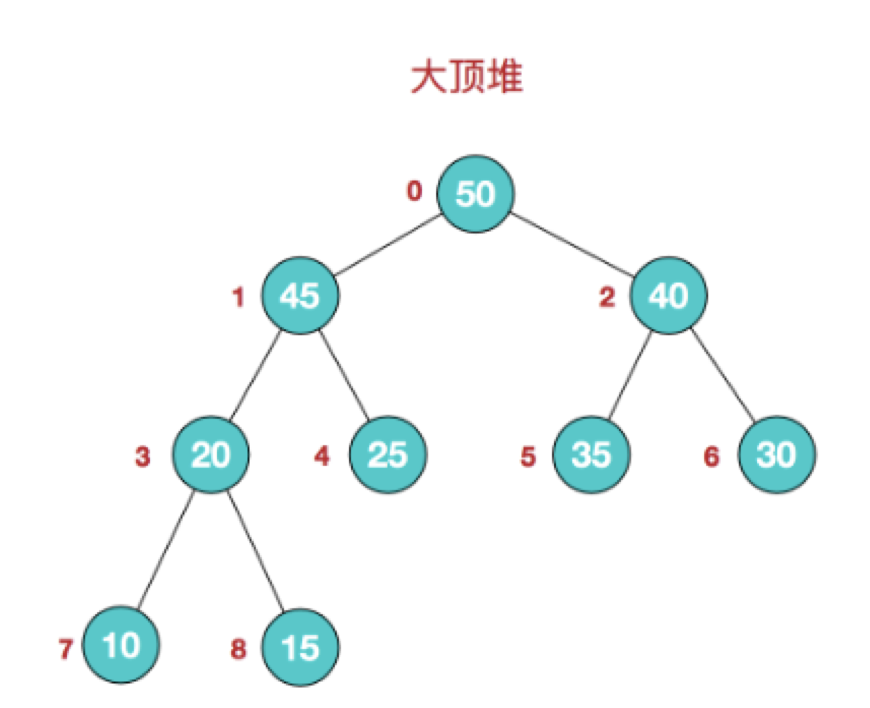
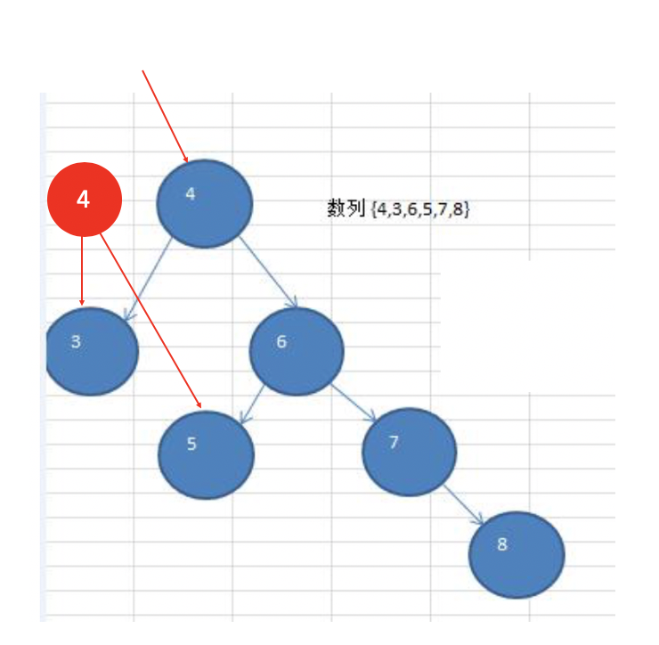
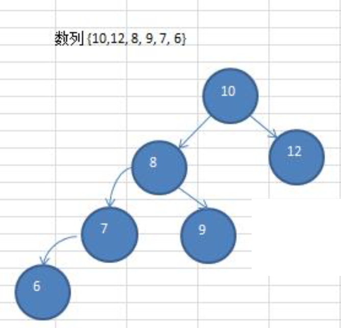
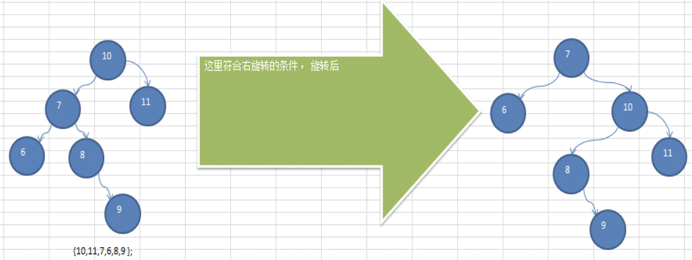
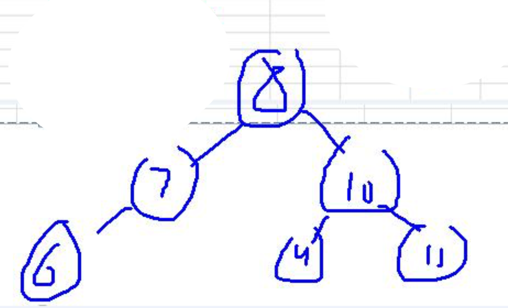
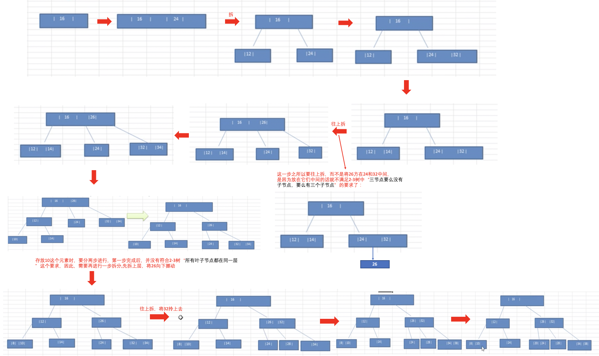
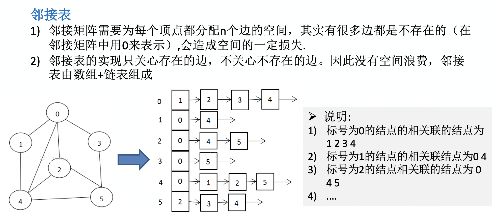
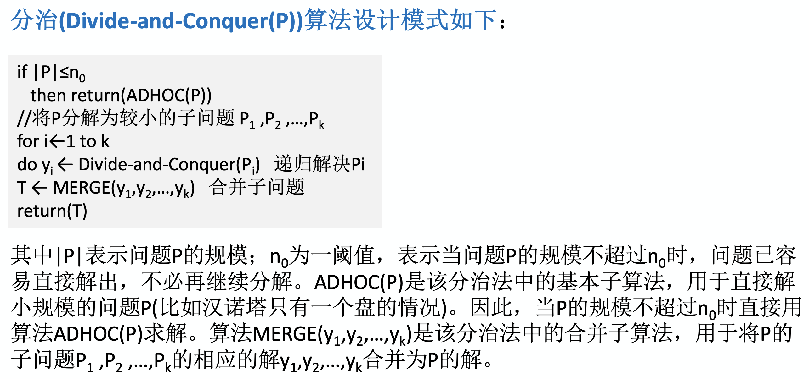

# 概述

- 程序 = 数据结构 + 算法

## 算法

- 计算机不是无限快的，计算机存储器也不是免费的，所以，计算时间是一种有限资源，存储器中的空间也是一样。
- 设计优良的算法甚至可以将程序运行的速度提高数百万倍。与此相反，花费时间和金钱去购置新的硬件可能只能将速度提高十倍或是百倍。即，整个系统的性能不但依赖于选择快速的硬件，还依赖于选择有效的算法。

## 数据结构

- Data Structure: 存储和组织数据的方式。数据结构是算法的副产品或是结果。重要的是要知道数据结构的优势和局限。

- 1968年，Donald E. Knuth 教授在其所写的 《计算机程序的艺术》第一卷《基本算法》中，较系统地阐述了数据的逻辑结构和存储结构及其操作，开创了数据结构的课程体系。同年，数据结构作为一门独立的课程，在计算机科学的学位课程中开始出现。
	-  

- 常用数据结构：

### 数据结构的分类

- 逻辑结构是面向问题的，存储结构是面向计算机的，存储结构的目的是将数据及其逻辑关系存储到计算机中。

#### 逻辑结构

- 逻辑结构：数据**元素**之间的相互关系。

1. 集合结构：类似于数学中的集合，各数据元素除了同属于一个集合外，它们之间没有其他关系。即，各元素是"平等"的，它的共同属性是"同属于一个集合"。
   - 


2. 线性结构：
   - 数据元素之间是一对一的线性关系，如数组，各个数据元素连成了一条线：
   - 常见的线性结构：数组、队列、链表、栈。

3. 非线性结构：
   - 非线性结构不是一对一的关系，而是一种一对多(如树结构)或多对多(如图结构)的关系。
   - 常见的非线性结构：二维数组，多维数组，广义表，树结构，图结构。
   - 
   - 


### 存储结构(物理结构)

- 存储结构(物理结构)：**或者说存储方式**，是指数据的逻辑结构在计算机中的存储形式，即，如何把数据元素存储到计算机的存储器中。

1. 顺序存储结构：把数据元素存放在地址连续的存储单元里，其数据间的逻辑关系和物理关系是一致的。数组采用的就是顺序存储方式。
   - 

2. 链式存储结构：把数据元素存放在任意的存储单元里，这组存储单元可以是连续的，也可以是不连续的。在链式存储结构中，数据元素的存储关系并不能反映其逻辑关系，因此需要用一个指针存放数据元素的地址，通过地址来找到相关联数据的位置。链表采用的就是链式存储方式。
   - 


# 抽象数据类型(abstract data type, ADT)

- 抽象数据类型有一种伪代码的意味，无关具体实现，抽象地定义了一个数据对象、数据对象中各元素之间的关系及对数据元素的操作。举例来说，超级玛丽游戏，我们确定了游戏主角Mario，给他定义了几种基本操作：走、跳、打子弹等。

- 抽象数据类型格式：

   ```
   ADT 抽象数据类型名

   Data
      数据元素之间逻辑关系的定义

   Operation
      操作1
      操作2
      ...

   endADT
   ```

# 稀疏数组(Sparse Array)

## 应用场景

- 一个6*6的棋盘，可以用二维数组表示，其中黑棋用1表示，白棋用2表示。对棋盘进行存盘处理，可以使用稀疏数组，得到一个"压缩"的效果。

```java
0 0 0 0 0 0
0 1 0 0 0 0
0 0 2 0 0 0
0 0 0 0 0 0
0 0 0 0 0 0
0 0 0 0 0 0
```

## 稀疏数组

- 当一个数组中大部分的元素为0，或者为同一个值时，可以使用稀疏数组来保存该数组。
- 稀疏数组的处理方法：
    1. 记录数组一共几行几列，有多少个不同的值
    2. 把具有不同值的元素的行、列、值记录在一个小规模的数组中
    - 

 ## 二维数组和稀疏数组的互相转换

 - 
   - 稀疏数组写入文件、从文件读取稀疏数组属于I/O的内容

# 线性表(List)

- 线性表是**有限的序列**。
  - 序列：元素之间有顺序，第一个元素无前驱，最后一个元素无后继，其他每个元素都有且只有一个前驱和后继。
  - 有限：即元素个数是有限的，元素的个数即为线性表的长度。
  - 在较复杂的线性表中，一个数据元素可以由若干个数据项组成(比如一个学生对象，可以有姓名、年龄、性别等数据项)。

- 线性表可以用一维数组(顺序存储结构)或链表(链式存储结构)实现。

- 线性表的抽象数据类型：
   ```
   ADT List

   Data
      {a1, a2, ...}
      每个元素只有一个前驱元素、一个后继元素(首尾元素除外)

   Operation
      showList: 遍历输出List
      isEmpty: 判定List是否为空
      insertElement: 插入元素
      ...

   endADT
   ```

## 用数组实现List

- `com.mosaicsheep.list.arraylist.List`

- 

- 用数组实现list的优缺点：
  - 优点：按索引读取快
  - 缺点：插入和删除元素时需要移动大量元素，会耗费大量时间；造成存储空间的"碎片"，比如，在进行删除操作时，由于要对大量元素进行前移，会在list的尾部产生垃圾值。 

## 用链表实现List

- 详见链表(Linked list)。


# 队列

## 应用场景

 - 银行，若干个业务窗口，排队叫号，先进先出。
 	- 实时的排队系统，用队列结构比较好，用数组的话，需要考虑溢出以及新增和删除后的数据移动。

## 队列

- 队列是一个有序列表，可以用数组或链表来实现。
- 队列遵循先入先出(FIFO)的原则，队列限定只能在一端插入、另一端删除，允许删除的一端叫front，允许插入的一端叫rear。


## 用数组实现队列

### 数组模拟普通队列

- 


### 数组模拟环形队列

1. 
2. 
   - front指向队列的第一个元素，即arr[front]就是队列的第一个元素，front的初始值为0
   - rear指向队列的最后一个元素的后一个位置，空出一个空间作为一个约定，rear的初始值为0
   - 队列满员的条件：(rear + 1) % maxSize = front
   - 队列为空的条件：rear = front 
   - 队列中有效数据的个数为(rear + maxSize - front)%maxSize


# 链表(Linked list)

- 链表是以节点的方式来存储，各个节点不一定连续存储
- 每个节点包含data域和next域(指向下一个节点)
- 链表分为带头节点的链表和不带头节点的链表

## 单向链表

- 


- 单链表的反转：
  1. 先定义一个头节点，reverseHead = new HeroNode();
  2. 从头到尾遍历原来的链表，每遍历一个节点，就把它取出来放在新的链表的最前端
  3. 原来链表的head.next = reverseHead.next

- 从尾到头打印单链表：
   1. 先将单链表反转，然后再进行遍历，这种方式会破坏原来链表的结构。
   2. 利用栈结构，将各个节点压入到栈中，然后利用栈先进后出的特点实现逆序打印的效果。


## 双向链表

- ```
  `com.mosaicsheep.linkedlist.DoubleLinkedListDemo`
  ```

- 单链表比双链表的构造简单，但是，单链表的操作要比双链表复杂：
   1. 双向链表可以向前或者向后查找。
   2. 单向链表不能自我删除，需要辅助节点，而双向链表可以自我删除。

- 双向链表示意图：

- 基本功能：
  1. 遍历输出整个链表
  2. 链表的增(add)、删(delete)、改(update) 

## 单向环形链表

### 应用场景

- 约瑟夫问题：设编号为1，2，… n的n个人围坐一圈(可以想象丢手绢的场景)，约定编号为k(1<=k<=n)的人从1开始报数，数到m的那个人出列，它的下一位又从1开始报数，数到m的那个人又出列，依次类推，直到所有人出列为止，由此产生一个出队编号的序列。

- 


### 利用单向环形链表解决约瑟夫问题

- `com.mosaicsheep.linkedlist.JosephusDemo`
	- 创建和遍历单向环形链表：
	- 求解约瑟夫问题： 


## 数组和链表的对比

- 将数据存储到内存时，你请求计算机提供存储空间，计算机给你一个存储地址。当需要存储多项数据时，由两种基本方式：数组和链表。
  - 数组是顺序存储的，当你要用数组存储多项数据时，需要计算机提供连续空间。如果请求的空间少了，当新增数据时，整个数组都要转移，因此，在创建数组时，通常需要额外请求一些"预留座位", 这些额外请求的位置可能根本用不上，你没有使用，别人也用不上，造成内存浪费。
  - 链表是链式存储的，见缝插针。但是，在需要读取链表的最后一个数据时，你不能直接读取，因为你不知道它所处的位置，必须先访问元素#1，从中获取元素#2的地址...以此类推，直到访问到最后一个元素。即，**链表只能顺序访问，而不能随机访问(不能跳着读取元素)**。


# 栈

- 

## 应用场景

1. 表达式的转换(中缀表达式转后缀表达式)与求值

2. 子程序的调用:在跳往子程序前，会先将下个指令的地址存到堆栈中，直到子程序执行完后再将地址取出，以回到原来的程序中


3. 处理递归调用:和子程序的调用类似，只是除了存储下一个指令的地址外，也将参数、区域变量等数据存入堆栈中

4. 二叉树的遍历

5. 图形的深度优先(depth-first)搜索法

## 用数组模拟栈

- `com.mosaicsheep.stack.ArrayStackDemo`

## 中缀表达式

- 中缀表达式：(3+4)×5-6，中缀表达式对计算机来说不好操作，需要判断操作符的优先级，因此，在计算时往往将中缀表达式转成其他表达式来操作(一般转成后缀表达式)。

- 

？？？？？有bug


## 前缀表达式

- 前缀表达式(波兰表达式)：运算符都位于操作数之前，举例来说，(3+4)×5-6对应的前缀表达式就是-×+3456。

- 求解前缀表达式：
   - 从右至左扫描表达式，遇到数字时，将数字压入堆栈，遇到运算符时，弹出栈顶的两个数，用运算符对它们做相应的计算(栈顶元素和次顶元素)，并将结果入栈；重复上述过程直到表达式最左端，最后运算得出的值即为表达式的结果。
   - 举例来说，(3+4)×5-6对应的前缀表达式就是- × + 3 4 5 6，求值步骤如下:
     1. 从右至左扫描，将6、5、4、3压入堆栈
     2. 遇到+运算符，因此弹出3和4(3为栈顶元素，4为次顶元素)，计算出3+4的值，得7，再将7入栈。
     3. 接下来是×运算符，因此弹出7和5，计算出7×5=35，将35入栈。
     4. 最后是-运算符，计算出35-6的值，即29，由此得出最终结果。


## 后缀表达式

- 后缀表达式(逆波兰表达式)：运算符位于操作符之后，举例来说，(3+4)×5-6对应的后缀表达式就是34+5×6-。

- 

- 求解后缀表达式(`com.mosaicsheep.stack.PolandNotation`)：
  - 从左至右扫描表达式，遇到数字时，将数字压入堆栈，遇到运算符时，弹出栈顶的两个数，用运算符对它们做相应的计算(次顶元素和栈顶元素)，并将结果入栈；重复上述过程直到表达式最右端，最后运算得出的值即为表达式的结果。
  -举例来说，(3+4)×5-6对应的后缀表达式就是 3 4 + 5 × 6 -，求值步骤如下:
    1. 从左至右扫描，将3和4压入堆栈；
    2. 遇到+运算符，因此弹出4和3(4为栈顶元素，3为次顶元素)，计算出3+4的值，得7，再将7入栈；
    3. 将5入栈；
    4. 接下来是×运算符，因此弹出5和7，计算出7×5=35，将35入栈；
    5. 将6入栈；
    6. 最后是-运算符，计算出35-6的值，即29，由此得出最终结果。	 


## 中缀表达式转后缀表达式

- `com.mosaicsheep.stack.PolandNotation2`

- 中缀表达式转后缀表达式步骤：
  1. 初始化两个栈：运算符栈s1和储存中间结果的栈s2；
  2. 从左至右扫描中缀表达式；
  3. 遇到操作数时，将其压s2；
  4. 遇到运算符时，比较其与s1栈顶运算符的优先级：
     1. 如果s1为空，或栈顶运算符为左括号(，则直接将此运算符入栈；
     2. 否则，若优先级比栈顶运算符的高，也将运算符压入s1；
     3. 否则，将s1栈顶的运算符弹出并压入到s2中，再次转到(4-1)与s1中新的栈顶运算符相比较。
  5. 遇到括号时：
      1. 如果是左括号(，则直接压入s1。
      2. 如果是右括号)，则依次弹出s1栈顶的运算符，并压入s2，直到遇到左括号为止，此时将这一对括号丢弃。
  6. 重复步骤2至5，直到表达式的最右边。
  7. 将s1中剩余的运算符依次弹出并压入s2。
  8. 依次弹出s2中的元素并输出，结果的逆序即为中缀表达式对应的后缀表达式。

- 根据上面的步骤：

## 队列和栈的对比

- 队列和栈，既可以使用数组来实现，也可以使用链表来实现。
   - 用数组实现，要处理扩容缩容的问题；
   - 用链表实现，没有扩容缩容的问题，但需要更多的空间存储节点指针。

# 递归(Recursion)

- 理解递归的关键：递归就是自上而下，怎么个自上而下法？顺着一个枝节一直往下走，走到底为止。Boss只是傻傻地进行分解，然后每次只等一个小弟的反馈，这个小弟反馈了之后，再去找第二个小弟要反馈。

- 递归：方法自己调用自己，每次调用时传入不同的变量。递归函数会使用到调用栈(call stack)。

## 递归调用机制

- 

- 执行一个方法时，就创建一个受保护的独立空间(栈空间)，也就是说，递归的底层是要用到栈结构的。
- 方法的局部变量如果是基本数据类型的，就相互独立，不会相互影响；如果方法中使用的是引用类型的变量(比如数组)，就会共享该引用类型的数据。
- 每个递归函数都有两部分：基线条件(base case)和递归条件(recursive case)。 递归必须向退出递归的条件（即基线条件）逼近，否则会无限递归，出现栈溢出(Stack Overflow)。
- 当一个方法执行完毕，或者遇到return，就会返回，谁调用了这个方法，就将结果返回给谁。

## 利用递归回溯(recursive backtracking)解决迷宫问题

- 

- 回溯：全都置为3 冲突了需要回溯,同时找到一个解之后仍然需要回溯
- 如何求解最短路径？可以设置一个数组，将上下左右的策略放进数组，进行循环。

## 八皇后问题

- 八皇后问题：国际象棋棋盘上摆放八个皇后，任意两个皇后都不能处于同一行、同一列或同一斜线上。高斯一共找到了76种摆法。后来有人用图论严格证明，一共有92种摆法，排除对称性，一共有12种摆法。
  
- 
  
- 求解思路分析：
	- 用递归的思维方式去解答，问题就简单：不妨假设棋盘上1到7行已经摆好了满足条件的7个皇后，那么只需要把最后一个皇后，分别放到第八行的每个位置试一下，只要不冲突，就可以找到答案了。那么前7个皇后怎么摆呢？和前一步一样，不防假设前6个皇后已经摆在了正确的位置。接下来以此类推。递归到第1行时，棋盘上没有一个皇后，那只需要把第一个皇后放在第一行的8个位置上分别试一下。当然，这种尝试会有很多种情况并不需要递归到第一行。

  http://www.7k7k.com/swf/49842.htm 

## 递归(Recursion)与迭代(Iteration)

- 阶乘：计算5!，迭代的思维一般是按照1 x 2 x 3 x 4 x 5的顺序计算。而递归的思维则是5! = 5 x 4!，那么4!是什么呢？不重要，因为4! = 4 x 3!。这样一直往前推，直到1! = 1。这个时候再把每个值往回代入计算，就能得到最终的结果。
  - 

- 斐波那契数列: 1,1,2,3,5,8,13…… 这个数列从第3个数字开始，每个数字都等于前两个数字相加。问题是第100个数字是什么？迭代的思维一般是一个一个往后加，直到找到第100个。而递归的思维是，第100个数字等于第99个数字加第98个数字，而第99个数字等于第98个数字加第97个数字，递归下去，最终只要知道第1个数字和第2个数字的值，就可以回溯回去，第100个数字的值也就知道了。 
  - 

- 递归是自顶而下的，需要有一个边界限制，否则就会无限递归；与迭代相比，递归的效率不高，例如，在八皇后问题中，对8×8的棋盘进行回溯时，大概执行15000多次。
  - 递归函数会使用到调用栈(call stack)，每个函数调用都要占用一定的内存，如果栈很高，就意味着计算机存储了大量函数调用的信息。在这种情况下，可以选择使用循环或尾递归(并非所有的语言都支持尾递归 )。
  - "如果使用循环，程序的性能可能更高；如果使用递归，程序可能更容易理解。如何选择要看什么对你来说更重要。"


# 算法的时间复杂度

- 衡量一个算法的执行时间：
  - 事后统计法：同一台计算机在相同状态下运行不同的算法，比较哪个算法的速度快。
  - 事前估算：通过时间复杂度来判断。 

## 时间频度

- 时间频度：一个算法花费的时间与该算法中语句的执行次数成正比，哪个算法中语句执行的次数多，它花费的时间就多。一个算法中的语句执行次数称为时间频度(语句频度)，记为T(n)。
  - 比如，A算法用了10条语句完成了排序，而B算法用了20条语句完成了排序，那么B算法花费的时间要比A多。 

```java
// 计算1到100的数字之和，运算规模为100，即T(n)中 n = 100
int sum = 0;
int end = 100;

// 使用for循环
// T(n) = n + 1 
// n = 100，为什么是n+1? 因为最后还要判断一次 i <= end，然后才退出循环
for(int i = 1; i < = end; i++){
   sum += i;
}

// 直接计算，T(n) = 1
// 即，不管n多大，只需执行一次就能完成求和
sum = (1 + end) * end/2;
```

## 时间复杂度(Time complexity)

- 时间复杂度是根据时间频度推导出来的：
  - $\lim_{n \to \infty}{\frac{T(n)}{f(n)}}=非零常数$ ，即f(n)是T(n)的同阶无穷大，记作T(n) = O(f(n))，O(f(n))称为O(f(n))为算法的渐进时间复杂度，简称时间复杂度。
  - 例如，$T(n) = 2n^2 + n + 3$， $f(n) = n^2$， $\lim_{n \to \infty}{\frac{T(n)}{f(n)}}=2$， 那么该算法的时间度为$O(n^2)$。

- 两家公司相距50米，通过网络传输一个u盘的数据，和用一只鸽子传递一个u盘的数据。对于鸽子来说，不管u盘里面的数据有多少，它传送数据所花费的时间是固定的，即$O(1)$；对于网络传输，则是$O(n)$，即传输速度是与u盘里的数据量有关的。

- 关于大O表示法：
   1. 大O表示法让你能够**比较操作数**，指出的算法运行时间的**增速**。比如，$O(log_n)$比$O(n)$快，且当需要操作的元素越多时，前者比后者快得越多。
   2. 大O表示法指出了最糟糕情况下的运行时间，举例来说，在电话簿中找人，简单查找的运行时间是O(n)，这意味着在最糟糕的情况下，必须查看电话中的每个条目。当然也可能一次就找了，但是这是最佳的情形，大O表示法说的是最糟的情形，再差也不会超过O(n)了。
   - 
   3. O(n)中的n只是一个变量，可以用其他字母表示，也可以用不同的形式来表示：


## 常用时间复杂度

- 常用时间复杂度：$O(1) < O(log_2n) < O(n) < O(nlog_2n) < O(n^2) < O(n^3) < O(n^k) < O(2^n) < O(n!)$

```java
// 常数阶O(1)
// 无论代码执行了多少行，只要没有循环等复杂结构，时间复杂度就是O(1)
int i = 1;
int j = 2;
++i;
j++;
int m = i + j;
// 无论变量i、j取什么值(变量的规模)，都是执行5句

// 对数阶O(log_2n)
int i = 1;
while (i < n) {
   i = i * 2; 
   // i = 2、4、8、16... 
   // 假设一共循环x次，那么2^x = n时，退出循环，
   // x = log_2n
}

// 线性阶O(n)
// for循环里的代码要执行n遍
// 即，时间频度随着n的规模而变化
for(int i = 1; i <= n; i++){
   System.out.println();
}

// 线性对数阶O(nlog_2n)
for(int m = 1; m < n; m++){
   i = 1;
   while(i < n){
      i = i * 2;
   }
}

// 平方阶O(n^2)
// 双重for循环
for(int i = 1; i <= n; i++){
   for(int j = 1; j <= n; j++){
      System.out.println();
   }
}
// 如果将其中一层循环的n改为m， 那么时间复杂度就变成了O(m*n)
// 立方阶、k次方阶就是3层循环和k层循环
```

## 平均时间复杂度和最坏时间复杂度

- 平均时间复杂度：所有可能的输入实例以等概率出现的情况下算法的运行时间。

- 最坏时间复杂度：最坏时间复杂度是算法在任何输入实例上运行时间的界限，一般讨论的时间复杂度均是最坏情况下的时间复杂度，这就保证了算法的运行时间不会比最坏情况更长。

- 平均时间复杂度和最坏时间复杂度是否一致，和算法有关。
 
# 算法的空间复杂度(Space complexity)

- 空间复杂度：算法所耗费的存储空间，即，一个算法在运行过程中临时占用存储空间的大小。它也是问题规模n的函数。

- 在做算法分析时，主要讨论的是时间复杂度。从用户体验上来看，更看重的是程序执行的速度。一些缓存产品(如Redis)和算法(如基数排序)本质上就是用空间换时间。 


# 排序算法(Sort Algorithm)

- 排序：将一组数据按照指定的顺序进行排列。

- 排序的分类：
  1. 内部排序：将需要的所有数据都加载到内存中进行排序。
  2. 外部排序：当数据量过大时，无法全部都加载到内存中，因此需要借助外部存储进行排序，即，内存和外存结合，先加载一部分进行排序，再加载另外一部分进行排序，然后合并。
  -  


## 冒泡排序法(Bubble Sorting)

1. 第一次排序：第一个和第二个比，判断是否交换；第二个和三个比，判断是否交换交换；... 倒数第二个和倒数第一个比，判断是否交换。最终，最大(或最小的)元素冒泡出来，存放在倒数第一个位置。
2. 第二次排序：剔除掉冒泡出来的倒数第一个元素，继续按照第一次排序的逻辑，冒泡出次大(或次小)的元素。
3. 以此类推，直到冒泡出倒数第二大(小)的元素，那么剩余的一个元素一定是最小(大)的元素。

- 冒泡排序的时间复杂度为$O(n^2)$，即两个for循环。


## 选择排序法(Select sorting)

- 选择排序有点儿像打擂台，以由小到大排序为例：
  1. 第一次排序：找到最小的，和第一个元素交换(即放在第一个位置)。
  2. 第二次排序：刨去第一个元素(即最小的元素)，在剩下的元素中，找到最小的，和第二个元素交换(即放在第二个位置)。
  3. 以此类推，第n次排序找到当前轮次中最小的，放到第n个位置。
  4. 找到倒数第二小的元素，放在倒数第二个位置，此时倒数第一个位置的元素一定是最大的。

- 选择排序的时间复杂度为$O(n^2)$，即两个for循环。

- 选择排序法事例：
   - 
   - 上图所示的选择排序，加入歌单中有n首歌，第一次要查看n首歌，找到其中播放次数最多的，第二次要查看(n-1)首歌，找到播放次数第二多的...以此类推，查看(n-2)...2、1首歌。那么，总共查看了 1 + 2 + ... + n = n(n+1)/2次，我们知道，时间复杂度与系数和低次项无关，也就是说，时间复杂度为$O(n^2)$。

## 插入排序法(Insertion Sorting)

1. 把n个待排序的元素看成一个无序表和一个有序表
2. 最开始时，有序表中只包含第一个元素，无序表中包含后面的(n-1)个元素
3. 每次从无序表中取出第一个元素，将这个元素与有序表中的元素进行比较，将它插入到有序表中适当的位置
4. 以此类推，直到无序列表中的(n-1)个元素全部都插入到有序列表中

## 希尔排序法(Shell Sorting)

- 简单插入排序法存在的问题： 
   - 上图中，已经进行到最后一步，此时，有序列表为{2,3,4,5,6}，无序列表为{1}，要将1插入到有序列表中，需要从6的位置开始一步步地向前比对。

- 希尔排序也是一种插入排序，每次分组后都会进行插入排序，也称为缩小增量排序。

-  
-  
   - length为待排序的数据的个数。


## 快速排序（Quick Sort）

- 快速排序是对冒泡排序的一种改进，通过一趟排序将要排序的数据分割成两个独立的部分（关键是要找基准、分割线），其中一部分的所有数据都比另外一部分的所有数据要小，然后再按照此方法对这两部分数据分别进行快速排序，整个排序过程可以递归进行。

-  
   - 以11为基准，比11大的放右边，比11小的放左边。

### 分而治之（divide and conquer，D&C）

- 快速排序使用分而治之的策略，分而治之是递归的，它不是一种算法，而是一种解决问题的思路。

- 对排序算法来说，最简单的数组就是根本不需要排序的数组，即只有一个元素的数组或空数组，这就是快速排序的基线条件。分而治之策略要和数学归纳法协同使用：
```
第二数学归纳法：
（1）当n=1，2时，命题成立；
（2）假设当n≤k（k∈N）时，命题成立，由此可推得当n=k+1时，命题也成立。
那么根据①②可得，命题对于一切正整数n来说都成立。

1. 基线条件：显然，快速排序算法对基线条件（[] 或 [1]，即空数组和单元素数组）有效。

2. 归纳条件：
假设快速排序算法对含有小于5个元素的数组[3, 1, 4, 2]有效，对于含有5个元素的数组[5, 3, 1, 4, 2]，可以有5个基准点，按照这5个基准点分区的情况如下：

3 1 4 2 *5* []
1 4 2 *3* 5
[] *1* 5 3 4 2 
3 1 2 *4* 5
1 *2* 5 3 4

以上的子数组都是小于5个元素的数组，只需使用快速排序法对子数组进行排序，最后进行拼接就行了。


def quicksort(array):
    if len(array) < 2:
        return array
    else:
        pivot = array[0]
        less = [i for i in array[1:] if i <= pivot]
        greater = [i for i in array[1:] if i > pivot]
        return quicksort(less) + [pivot] + quicksort(greater)

print(quicksort([10, 5, 2, 3]))
```

## 归并排序（Merge Sort）

- 归并排序使用了分而治之的策略。

- 归并排序的时间复杂度很低，比如，$2^{10}$个数据，要分$log_2 2^{10}$次，也就是10次，而数据量扩大2倍到$2^{11}$个数据，也只是需要多分1次而已（$log_2 2^{11}$= 11）。

- 

## 基数排序（Redix Sort）

- 基数排序属于分配式排序（distribution sort），是桶排序（bucket sort/ bin sort）的扩展。

- 基数排序属于稳定性的排序，举例来说，对{3, 1, 43, 1}进行排序，排序后的数组为{1, 1, 3, 43}，原先在前面的1仍然在前面。

- 
- 
   - 一共10个桶，代表0～9。第一轮按照数组元素的个位数放到桶里，第二轮按照数组元素的十位数（没有十位数的数字前面补零，比如，3被当作03）放到桶里...基数排序排几轮要看最大位的个数。
   - 有负数的数组不能用基数排序，此外，基数排序是空间换时间的算法，数据量大时，会出现outOfMemoryError。


## 堆排序

- 堆排序与二叉树相关，在学完二叉树后再来学习堆排序。

## 排序算法对比

 - 
   - 稳定：数组在排序过程中仍然保持着相对稳定的前后顺序。比如，a = b，排序前a在b前，排序之后，a仍然在b前。
   - In-place：不占用额外内存
   - Out-place：占用额外内存
   - k指的桶的个数

- Why we need stable sort? Suppose we have a list of first and last names. We are asked to sort "by last name, then by first". We could first sort (stable or unstable) by the first name, then stable sort by the last name. After these sorts, the list is primarily sorted by the last name. However, where last names are the same, the first names are sorted.


# 查找算法（Search Algorithm）

## 线性查找（Sequence Search）

- 线性查找有两种情况：一种是查到一个满足条件的值就返回对应的索引；一种是要查到所有满足条件的值，这时候需要用一个数组来盛放所有满足条件的索引。


## 二分查找（Binary Search）

- Binary search can find an element(or more) inside a sorted array. Before Binary Search, the array should be sorted. 

- There are two types of Binary Search: recursive and non-recursive.这里只使用递归的方式。

- base case:
   1. 找到就结束递归
   2. 递归完整个数组也没有找到，即left > right

- 
- 

- 二分查找有递归和非递归两种实现方式。


## 插值查找（Interpolation Search）

- {1, 2, 3, 4, 5, 6, 7, 8, 9, 10}，对于这样连续的数组，如果使用二分查找查找1的话，需要查找很多次。不同于二分查找，插值查找每次从自适应mid处开始查找：
   - 
   - 其中key就是待查找的值。
   - 以查找1为例，根据上面的公式，`int mid = 0 + （99 - 0） * （1 - 1）/ （100 - 1） = 0`

- 对于数据量较大，关键字分布比较均匀的查找表来说，采用插值查找速度较快。关键字分布不均匀的情况下，该方法不一定比折半查找要好。


## 斐波那契查找（黄金分割法）

- 斐波那契数列：{1, 1, 2, 3, 5, 8, 13, 21, 34, 55} 相邻两个数字的比例无限接近0.618，比如34/55 = 0.618。

- mid位于黄金分割点附近，`mid = low + F(k-1) - 1`，F代表斐波那契数列，k代表斐波那契的第几个元素。
   - 
   ```
   F(k) = F(k-1) + F(k-2) 
            ⬇
   F(k) - 1 = (F(k-1) - 1) + (F(k-2) - 1) + 1
   即，可以将长度为 F(k) - 1 的顺序表，分为长度为 F(k-1) - 1 和 F(k-2) - 1 的两段，
   中间位置即为 mid =  low + F(k-1) - 1。
   类似地，每一个子段也可以用相同的方式分割。
   ```
   - 这里的k值，只要能使`F(k)`恰好等于n就行了；但是，顺序表长度n不一定刚好等于`F(k)`（即，n不一定刚好是斐波那契数列中的一个数字），所以需要将原来的顺序表的长度n增加至`F(k)`。


# 哈希表（Hash table）

- 哈希表也叫散列表，可以通过`数组+链表`或者`数组+二叉树`的方式来构建哈希表，以`数组+链表`为例：
   - 
   - 数组里面的每个元素都是一条链表。

- 使用场景：有一个公司，当有新的员工来报道时，要求将该员工的信息加入（id，性别，年龄，住址等），当输入该员工的id时，要求查找到该员工的所有信息。要求不使用数据库，尽量节省内存，速度越快越好。
   - 


# 树

- ArrayList底层维护了一个数组(Object[] elementData)，是按照一定的比例来扩容的。
   - 当创建对象时，如果使用的是无参构造器，初始elementData容量为0
   - 如果使用的是指定容量capacity的构造器，则初始elementData容量为capacity
   - 当添加元素时，先判断是否需要扩容，如果需要扩容，则调用grow方法，否则直接添加元素到合适位置
   - 如果使用的是无参构造器，如果是第一次添加，需要扩容的话，则扩容elementData为10，如果需要再次扩容的话，则扩容elementData为1.5倍
   - 如果使用的是指定容量capacity的构造器，如果需要扩容的话，则直接扩容elementData为1.5倍

- 树结构结合了数组和链表的优点，即，既能提高数据存储、读取的效率，同时也可以保证数据的插入、删除、修改的速度。如果以二叉树排序来存储数据，那么对数据的增删改查的效率都可以提高。

## 树的常用术语

-  

## 二叉树

- 二叉树：每个节点最多只能有两个子节点（只有一个也行）。
   -  
 

- 满二叉树：二叉树的所有子节点都在最后一层，并且节点总数为 $2^n-1$， 其中n为层数。
   -  

- 完全二叉树：所有的叶子节点都在最后一层或倒数第二层，而且最后一层的叶子节点在左边连续，倒数第二层的叶子节点在右边连续。
   -  


### 二叉树的遍历

- 根据输出父节点的顺序，分为三种遍历：
   1. 前序遍历：先输出父节点，再遍历左子树和右子树
   2. 中序遍历：左子树 -> 父节点 -> 右子树
   3. 后续遍历：左子树 -> 右子树 -> 父节点

-  


### 二叉树的查找

- `com.mosaicsheep.binarytree.BinaryTreeSearch`


### 二叉树删除节点

- 如果是叶子节点（没有子节点的节点）， 则直接删除该节点； 如果删除的节点是非叶子节点，则删除该子树。

- 仍然以上图（二叉树遍历）为例，当我要删除节点5关胜时，我不能将指针放在节点5上面，而应该将指针放在节点3上，然后判断节点3的子节点5是否应该被删除，如果应该被删除，那么令`this.left = null;`


## 顺序存储二叉树

- 数组就是一个顺序结构，而从存储方式来看，数组存储方式和树的存储方式可以相互转换。以数组的方式来存放二叉树，同时要求在遍历数组时，仍然可以以`前序遍历`、`中序遍历`、`后续遍历`的方式来完成节点的遍历。

- 顺序存储二叉树的特点：
   1. 通常只考虑完全二叉树
   2. 第n个元素的左子节点为`2*n + 1`
   3. 第n个元素的右子节点为`2*n + 2`
   4. 第n个元素的父节点为`(n-1)/2`（int取整）
   - n表示二叉树中的第几个元素，如图中二叉树所示： 
- 堆排序就会用到顺序存储二叉树。

## 线索化二叉树（Threaded Binary Tree）

- n个节点的二叉树中，空指针域的个数为 $2n - (n-1) = n + 1$ 个， 以下图为例，一共有6个节点，空指针域有7个。
   -  
   
- 在空指针域中，存放指向该节点 在某种遍历次序下 的前驱和后继节点的指针，这种附加的指针称为**“线索”**。如下图所示，节点8没有子节点，因此它有两个空指针域，假定是中序遍历，我们将其中一个空指针域指向它的后继节点3，这样就加上了线索。
   -  

- 根据线索性质不同，线索二叉树可以分为前序线索二叉树、中序线索二叉树、后续线索二叉树。
   -  

- 我们可以遍历上图所示的线索化二叉树，详见代码。当线索化二叉树后，`node`节点的属性`left`和`right`，有如下情况:
   - left 指向的是左子树，也可能是指向的前驱节点. 比如1节点`left`指向的左子树, 而10节点的`left`指向的就是前驱节点。
   - `right`指向的是右子树，也可能是指向后继节点，比如1节点`right`指向的是右子树，而10节点的`right`指向
  的是后继节点。
  - 线索化后，各个结点指向有变化，因此原来的遍历方式不能使用，这时需要使用新的方式遍历线索化二叉树，各个节点可以通过线型方式遍历，因此无需使用递归方式，这样也提高了遍历的效率。遍历的次序应当和中序遍历保持一致。


  ## 树的实际应用

  ### 堆排序

- 堆排序是一种**选择排序**，利用了堆这种数据结构。最坏、最好、平均时间复杂度均为`O(nlogn)`，属于**不稳定排序**。

- 堆：堆是一种完全二叉树
   - 大顶堆：每个结点的值都大于或等于其左右子结点的值，一般的话，升序采用大顶堆
   - 小顶堆：每个结点的值都小于或等于其左右子结点的值，一般的话，降序采用小顶堆
   -  

- 上图所示的大顶堆，可以映射到数组中：
   -  

- 堆排序基本思想：
   1. 将待排序的序列构造成一个大顶堆映射的**数组**（我们没有创建树，而是创建了一个映射着大顶堆的数组）
   2. 整个序列的最大值，就是堆顶的根节点
   3. 将其与数组的末尾元素进行交换，那么此时，末尾就成了最大值
   4. 将剩余的`n-1`个元素重新构造成一个堆，这样就会得到`n`个元素的次小值。如此反复执行，就得到一个有序的序列了。

- 举例来说，原始数组为`{4,6,8,5,9}`，我们将它升序排序：
   1. 首先我们要将上面的数组调整为一个大顶堆数组：
      -  
      -  
      -  
      -  

   2. 得到大顶堆数组后，我们将堆顶元素与末尾元素进行交换，使末尾元素最大，然后继续调整堆，再将堆顶元素与末尾元素进行交换，得到第二大元素，如此反复进行交换、重建、交换：
      -  
      -  


### 赫夫曼树(Huffman Tree)

- 霍夫曼树是带权路径长度最短的树，**权值越大的结点离根越近**。即，给定n个权值作为n个叶子节点，构造一棵二叉树，若该树的`带权路径长度（wpl）`达到最小，称这样的树为**最优二叉树**，也叫**霍夫曼树**。

- 路径：在一棵树中，从一个结点往下可以达到的子节点或孙子结点之间的通路，称为**路径**。通路中分支的数目称为**路径长度**，若规定根结点的层数为1，则从根结点到第L层结点的路径长度为L-1。
   - 举例来说，图中根结点到第三层的13结点的路径长度就是`3-1=2`: 

- 结点的权：将树中的结点赋给一个有着某种含义的数值，则这个数值称为该结点的**权**，比如上图中第三层的第一个结点，我们将13这个数值作为权赋给了它。

- 结点的带权路径长度：从根结点到该结点之间的路径长度与该结点的权的乘积。还是以13结点为例，路径长度为2，权为13，那么带权路径长度就是`2*13=26`。

- 树的带权路径长度（weighted path length）：所有**叶子节点**的带权路径长度之和。
   -  
   - 图中第二棵树是霍夫曼树，其中权值最大的结点13离根结点最近。

- 给定一个数列{13, 7, 8, 3, 29, 6, 1}，将其转换成霍夫曼树：
   1. 从小到大进行排序，得到`{1,3,6,7,8,13,29}`，其中每个数据都是一个节点，每个节点可以看成是一颗最简单的二叉树
   2. 取出根节点权值最小的两颗二叉树，即1和3
   3. 组成一颗新的二叉树, 这棵新的二叉树的根节点的权值是前面两颗二叉树根节点权值的和，在本例中就是`1+3=4`:
   4. 此时，这颗新的二叉树的根结点组成的数组为`{4,6,7,8,13,29}`:
   5. 以根节点的权值大小再次排序，得到`{4,6,7,8,13,29}`，不断重复1-2-3-4的步骤（比如此时我们应该挑出4和6组成新的二叉树，且根节点的权值为`4+6=10`）：
   6. 直到数列中，所有的数据都被处理，就得到一颗赫夫曼树：


### 霍夫曼编码（Huffman Coding）

- 霍夫曼编码（算是一种算法）广泛地用于数据文件压缩，压缩率通常在20%～90%之间。霍夫曼编码是可变字长编码（VLC）的一种。

- 定长编码：
   - 
   - 在线转码工具：https://www.mokuge.com/tool/asciito16/ 

- 变长编码：
   - 

- 霍夫曼编码原理：
   - 
   - 霍夫曼编码是前缀编码，不具有多义性。
   - 霍夫曼树根据排序方法不同，对应的编码也可能不同。但是wpl是一样的，都是最小的，在本例中，不管按照哪种排序方法，最终的编码长度都是133，压缩率是一样的。

 - 代码放在Algorithm中。


### 二叉排序树（Binary Sort/Search Tree）

- 二叉排序树：左子节点的值比当前节点的值小，右子节点的值比当前节点的值要大；如果有相同的值，将此节点放在左子节点或右子节点都可以。
   - 举例来说，对于数据{7, 3, 10, 12, 5, 1, 9},对应的二叉排序树为：


- 二叉排序树的删除分为三种情况：
   - 
   1. 删除叶子节点，比如{2,5,9,12}：先找到待删除的节点，然后再找到这个节点的父节点，确定待删除节点是父节点的左子节点还是右子节点，最后进行删除。
   2. 删除只有一颗子树的节点，比如1：先找到待删除的节点，确定待删除的节点的子节点是左子节点还是右子节点；然后再找到待删除节点的父节点，同时确定待删除节点是父节点的左子节点还是右子节点。最后删除待删除节点，并将待删除节点的子节点挂到待删除节点的父节点上。  
   3. 删除有两颗子树的节点，比如{7,3,10}：比方说我们要删除的是10节点，先找到它的父节点7；然后从10节点的右子树找到值最小的节点，在这里是12，用临时变量保存这个值后，删除节点12；最后将节点10的值替换为临时变量的值，即10变为12。如果从左子树找的话，就要找到值最大的节点，比如我们要删除节点3的话，找到左子树值最大的节点2，将3和2的值交换即可。


## 平衡二叉树（AVL树）

- 二叉排序树可能存在的问题：
   - 

- 平衡二叉树：也叫平衡二叉搜索树（self-balancing binary search tree），又被称为AVL树，查询效率较高。
   - 平衡二叉树是一棵空树，或者它的左右两个子树的高度差的绝对值不超过1，并且左右两个子树都是平衡二叉树。
   - 平衡二叉树的常用实现方法有红黑树、AVL（AVL算法）、替罪羊树、Treap、伸展树等。
   - 

- 构建平衡二叉树涉及到单旋转（左旋转、右旋转）、双旋转。

- 以{4,3,6,5,8}为例进行左旋转：
   1. 先构建普通的二叉排序树：
   2. 左子树高度为1，右子树高度为3，因此要进行左旋转，降低右子树的高度
   3. 先创建一个节点，这个新节点的值为当前节点（根节点）的值，即4:
   4. 把新节点的左子树设置为当前节点的左子树，也就是让4指向3:
   5. 把新节点的右子树设置成当前节点的右子树的左子树，即让4指向5：
   6. 把当前节点（根节点）的值换为右子节点的值，即将根节点的4换成6：
   7. 把当前节点（根节点）的右子树设置为右子树的右子树：
   8. 把当前节点（根节点）的左子树设置为新节点：

- 以{10,12,8,9,7,6}为例进行右旋转：
   1. 先构建普通的二叉排序树：
   2. 左子树高度为3，右子树高度为1，因此要进行右旋转，降低左子树的高度
   3. 先创建一个节点，这个新节点的值为当前节点（根节点）的值，即10:
   4. 把新节点的右子树设置为当前节点的右子树，也就是让10指向12:
   5. 把新节点的左子树设置成当前节点的左子树的右子树，即让10指向9：
   6. 把当前节点（根节点）的值换为左子节点的值，即将根节点的10换成8：
   7. 把当前节点（根节点）的左子树设置为左子树的左子树：
   8. 把当前节点（根节点）的右子树设置为新节点：

- 在某些情况下，单旋转不能完成平衡二叉树的转换
   - 比如数列{10,11,7,6,8,9}，右旋转后并没有变成AVL树：
   - 上面的问题在于，虽然符合了右旋转的条件，但是我们看到，`左子树的右子树`的高度要大于`左子树的左子树`的高度，因此，要先对根节点10的左子节点7进行左旋转（也就是先对以7为根节点的树进行左旋转），然后再对以10为根节点的树进行右旋转。
   - 先对以7为根节点的树进行左旋转：
   - 再对以10为根节点的树进行右旋转：
    

# 多路查找树

- 二叉树存在的问题：二叉树需要加载到内存中，当节点较多、层数较高时，构建二叉树的速度会很慢，对二叉树进行操作的速度也会降低。

- 多叉树：在二叉树中，每个节点都有数据项，且每一个节点最多有两个子节点。 如果允许每个节点可以有更多的数据项和更多的子节点，就是多叉树（multiway tree），多叉树通过重新组织节点，减少树的高度，能对二叉树进行优化。
   - `2-3树`就是一棵多叉树：


- B树也是多叉树：
   - 
   - 节点的度：一个节点下面的子树的个数。比如A节点有两棵子树，那么A节点的度就是2：
   - 树的度：所有的节点的度中，最大的那个值。

## 2-3树

- 2-3树是最简单的B树结构，有如下特点：
   - 2-3树的所有叶子节点都在同一层（只要是B树都满足这个条件）
   - 有两个子节点的节点叫二节点，二节点要么没有子节点，要么有两个子节点
   - 有三个子节点的节点叫三节点，三节点要么没有子节点，要么有三个子节点
   - 2-3树是由二节点和三节点构成的树

- 构建2-3树，以{16, 24, 12, 32, 14, 26, 34, 10, 8, 28, 38, 20} 为例，要求**保证数据插入的大小顺序（满足二叉排序树的要求）**：
    - 


- 以{16, 24, 12, 32, 14, 26, 34, 10, 8, 28, 38, 20} 为例，构建2-3树详细步骤: 
   1. 2-3树的所有叶子节点都在同一层.(只要是B树都满足这个条件)
   2. 有两个子节点的节点叫二节点，二节点要么没有子节点，要么有两个子节点
   3. 有三个子节点的节点叫三节点，三节点要么没有子节点，要么有三个子节点
   4. 当按照规则插入一个数到某个节点时，不能满足上面三个要求，就需要拆，**先向上拆，如果上层满，则拆本层，拆后仍然需要满足上面3个条件**。 
   5. 对于三节点的子树的值大小仍然遵守(BST二叉排序树)的规则
   - 


## 234树

- 234树也是一种B树，构建过程与2-3树类似，只不过比2-3树多了一个`四节点`
 - 


## B树、B+树和$B^*$树
  
- B树：B-tree，B即Balanced。在MySQL中，某种类型的索引是基于B树或B+树的。
   - 

- B+树：是B树的变体，区别在于，B+树所有的数据都存放在叶子节点，非叶子节点不会存放数据了。
   - 
   - B+ tree相当于将一个链表进行了**分段**，最上层是分成`5-28`，`28-65`，`65+`的三段；第二层又进行了分段，将`5-28`分成了`5-10`，`10-20`，`20-28`这三段，这样总共将一个大的链表分成了9段。

- $B^*$树：是B+树的变体，在B+树的**非根、非叶子节点**上又增加了指向兄弟的指针。
   - 

# 图（graph）

- 为什么要有图：前面我们学习了线性表和树，线性表只能有一个直接前驱和一个直接后继，树也只能有一个直接前驱（即父节点）。当我们要表示多对多的关系时，就会用到图。

- 图的常用概念：
   - 
   - 

- 图的表示方法：
   1. 用二维数组来表示，即邻接矩阵：
   2. 用链表来表示，即邻接表：

- 图的创建：
   1. 用`ArrayList<String>`存储顶点
   2. 用二维数组`int[][] edges`保存结点之间的连接关系（邻接矩阵）


- 图的遍历一般有两种策略：
   1. 深度优先（Depth First Search, DFS）：从初始访问结点出发，初始访问结点可能有多个邻接节点，深度优先遍历的策略就是首先访问第一个邻接节点，然后再以这个被访问的邻接节点作为初始节点，访问它的第一个邻接节点...这样的访问策略是优先往纵向挖掘深入，而不是对一个结点的所有邻接节点进行横向访问。深度优先搜索是一个递归的过程。
   2. 广度优先（Broad First Search, BFS）：类似于一个分层搜索的过程（先将一层搜索完，再去搜索下一层），广度优先遍历需要使用一个**队列**，来保持访问过的节点的顺序，以便按这个顺序来访问这些结点的邻接节点。


- 图的深度优先遍历：
   1. 访问初始结点v，并标记结点v为已访问（用一个boolean数组记录哪个结点被访问）。
   2. 查找结点v的**第一个**邻接结点w。
   3. 若w存在，则继续执行4，如果w不存在，则回到第1步，将从v的下一个结点继续。
   4. 若w未被访问，对w进行深度优先遍历递归（即把w当做另一个v，然后进行步骤123）。
   5. 若w已经被访问了，查找结点v的w邻接结点的下一个邻接结点，转到步骤3。
   - 

- 图的广度优先遍历：
   1. 访问初始结点v并标记结点v为已访问。
   2. 结点v入队列
   3. 当队列非空时，继续执行，否则算法结束。
   4. 出队列，取得队头结点u。
   5. 查找结点u的第一个邻接结点w。
   6. 若结点u的邻接结点w不存在，则转到步骤3；否则循环执行以下三个步骤：
      1. 若结点w尚未被访问，则访问结点w并标记为已访问。 
      2. 结点w入队列 
      3. 查找结点u的继w邻接结点后的下一个邻接结点w，转到步骤6。
   - 

- 深度优先与广度优先对比：
   - 
   - 之前的深度优先图解有些表达不太准确，深度优先实际上是不断地递归查找**邻接节点**，当一个节点不再有邻接节点后，就会回溯到上一层，再去查找上一层节点的其他**邻接节点**。


# 分治算法(Divide and Conquer)

- 分而治之，将一个复杂的问题分解成两个或更多的相同或相似的子问题，再继续将子问题进行分解...直到最后子问题可以简单的直接求解。即，原问题的解是子问题的解的合并。分治算法可以求解一些经典问题：
   - 二分查找
   - 大整数乘法
   - 棋盘覆盖
   - 归并排序
   - 快速排序
   - 线性时间选择
   - 最接近点对问题
   - 循环赛日程表
   - 汉诺塔
   - 傅立叶变换（快速傅立叶变换）

- 分治算法在每一层递归上都有三个步骤：
   1. 分解：将原问题分解为相互独立、与原问题形式相同的子问题
   2. 解决：若子问题规模较小而容易被解决，则直接解决；否则递归地解各个子问题
   3. 合并：将子问题的解合并为原问题的解
   - 


## 汉诺塔问题

- 汉诺塔的传说：汉诺塔（又称河内塔）问题是源于印度一个古老传说的益智玩具。大梵天创造世界的时候做了三根金刚石柱子，在一根柱子上从下往上按照大小顺序摞着64片黄金圆盘。大梵天命令婆罗门把圆盘从下面开始按大小顺序重新摆放在另一根柱子上。并且规定，在小圆盘上不能放大圆盘，在三根柱子之间一次只能移动一个圆盘。假如每秒钟一次，共需多长时间呢？移完这些金片需要5845.54亿年以上，太阳系的预期寿命据说也就是数百亿年。真的过了5845.54亿年，地球上的一切生命，连同梵塔、庙宇等，都早已经灰飞烟灭。

- 汉诺塔的求解：
   1. 如果只有一个盘，从A塔直接移到C塔
   2. 如果有两个或两个以上的盘，我们总是可以看做是两个盘，**最下边的一个盘**以及**上面的盘**，然后分三步走：
      1. 先把上面的盘从A塔移到B塔
      2. 把最下边的盘从A塔移到C塔
      3. 最后把B塔的所有盘从B塔移到C塔   
      - 以三个盘子为例，演示这三步：


# 动态规划算法（Dynamic Programming）

- 应用场景：
   - 背包问题：背包问题主要是指一个给定容量的背包、若干具有一定价值和重量的物品，如何选择物品放入背包使物品的价值最大。其中又分`01背包`（每个物品最多放一个）和`完全背包`(每种物品都有无限件可用)，而`完全背包`可以转化为`01背包`。
   - 

- 动态规划算法的核心思想：将大问题划分为小问题进行解决，从而一步步获取最优解的处理算法。与分治算法不同，动态规划算法分解得到的子问题往往**不是相互独立的**，即，下一个子阶段的求解是建立在上一个子阶段的解的基础上，进行进一步的求解。动态规划算法可以通过**填表的方式**来逐步推进，得到最优解。

- 背包问题求解：
   - 每次遍历到的第i个物品，根据`w[i]`和`v[i]`来确定是否需要将该物品放入背包中。即对于给定的n个物品，设`v[i]`、`w[i]`分别为第i个物品的价值和重量，C为背包的容量。再令`v[i][j]`表示在前i个物品中能够装入容量为j的背包中的最大价值。我们进行填表，填表过程详见`背包问题.xlsx`。公式如下：
   ```Java
   v[i][0] = v[0][j] = 0;// 填入表的第一行和第一列是0
   if(w[i] > j){
      v[i][j] = v[i-1][j];// 新增商品的容量大于当前背包的容量，直接使用上一个单元格的装入策略
   } else{// j >= w[i]
      v[i][j] = max{v[i-1][j], v[i] + v[i-1][j-w[i]]};// v[i] 表示当前商品的价值；v[i-1][j-w[i]]则表示装入i-1个商品到剩余空间(j - w[i])的最大值
   }
   ```

# KMP算法(Knuth-Morris-Pratt)

- KMP算法的一个应用场景是字符串匹配问题，字符串匹配问题有两种解法，一个是暴力破解，一个就是KMP算法：
   - 
   - 


- KMP算法完成字符串匹配问题，以`str1= "BBC ABCDAB ABCDABCDABDE"`，`str2="ABCDABD"`为例：
   - 
   - 
   - 
   - 
   - 


# 贪婪算法

- 应用场景为集合覆盖问题：
   - 

- 贪婪算法：在对问题求解时，每一步都采取最优的选择。贪婪算法所得到的结果不一定是最优解，但都是相对接近最优解的结果。

- 求解集合覆盖问题：
   1. 穷举法：
   2. 贪婪算法：
      1. 遍历所有的广播电台, 找到一个覆盖了最多**未覆盖的地区**的电台(此电台可能包含一些已覆盖的地区，但没有关系） 
      2. 将这个电台加入到一个集合中(比如ArrayList), 想办法把该电台覆盖的地区在下次比较时去掉。
      3. 重复第1步直到覆盖了全部的地区
      - 详见`集合覆盖问题.xlsx`

# 普里姆算法（Prim）

- 应用场景：
   - 修路问题：

- 最小生成树（Minimum Cost Spanning Tree, MST）:修路问题的本质就是最小生成树问题。给定一个带权的无向连通图，如何选取一棵生成树，使得树上所有边上权的总和为最小，这就叫最小生成树。
   - 生成树：
   - 求最小生成树的算法分为`普里姆算法`和`克鲁斯卡尔算法`

- 普里姆（Prim）算法：求最小生成树，就是在包含n个顶点的连通图中，找出只有(n-1)条边包含所有n个顶点的连通子图，也就是所谓的**极小连通子图**。
   - 

# 克鲁斯卡尔算法（Kruskal）

- 应用场景：
   - 公交站问题：

- 克鲁斯卡尔算法也是用来求最小生成树的算法。
   - 基本思想：按照权值从小到大的顺序选择n-1条边，并保证这n-1条边不构成回路。
   - 具体操作：首先构造一个只含n个顶点的森林，然后依权值从小到大从连通网中选择边加入到森林中，并使森林中不产生回路，直到森林变成一棵树为止。
   - 


# 迪杰斯特拉算法

- 应用场景：
   - 最短路径问题：

- 迪杰斯特拉算法：计算一个顶点到其他顶点到最短路径，它到主要特点是以起始点为中心，向外层层扩展（广度优先搜索的思想），直到扩展到终点为止。

- 还差迪杰斯特拉算法解决最短路径问题，佛洛依德算法解决最短路径问题，以及骑士周游问题。


